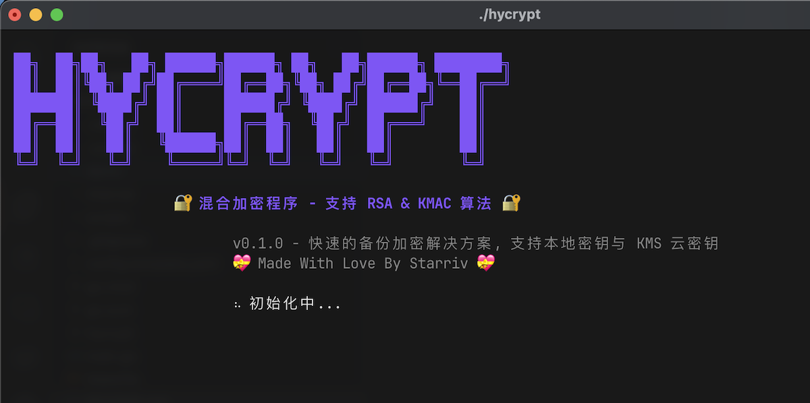

# HyCrypt

一个支持多种加密算法的现代化 Go 命令行工具，专注于安全、易用的文件和文本加密解密。

**💝 Made with love by Starriv 💝**




## 🎯 设计理念

本程序采用**输入驱动**的设计理念：

- 🎯 **用户为中心**：完全由用户指定要处理的内容，不预设输入目录
- 📁 **灵活输入**：支持拖拽文件/文件夹到命令行（通过 `-f` 参数）
- 📝 **文本支持**：支持管道和交互式文本输入（通过 `-t` 参数）
- 🎨 **现代界面**：提供美观的交互式 TUI 界面和传统命令行模式
- 🔐 **智能命名**：文件名包含算法标识和日期，便于识别和管理
- 🛡️ **安全第一**：采用业界标准的加密算法和安全实践

## ✨ 功能特性

### 🔐 加密算法支持

- **RSA-4096** 混合加密（公钥加密 + AES-GCM）
- **KMAC** 对称加密（密钥派生 + AES-GCM）
- 智能算法选择和自动检测

### 📁 多种输入方式

- **文件加密**：单文件、文件夹批量加密
- **文本加密**：支持管道输入、交互式输入、多行文本
- **十六进制**：文本加密可输出十六进制，便于传输和存储

### 🎨 用户界面

- **交互式 TUI**：现代化终端界面，引导式操作
- **命令行模式**：传统 CLI，支持脚本和自动化
- **ASCII 艺术**：美观的启动界面和进度显示

### 🛡️ 安全特性

- **混合加密**：大文件使用高效的混合加密方案
- **安全删除**：临时文件自动安全清理
- **权限控制**：严格的文件权限管理
- **密钥保护**：安全的密钥存储和管理

### ☁️ 多云 KMS 集成（规划中）

- **AWS KMS**：集成 Amazon Key Management Service
- **Azure Key Vault**：支持 Microsoft Azure 密钥管理
- **Google Cloud KMS**：对接 Google Cloud 密钥服务
- **阿里云 KMS**：支持阿里云密钥管理服务
- **腾讯云 KMS**：集成腾讯云密钥管理系统
- **统一接口**：提供标准化的多云 KMS 调用接口
- **密钥轮换**：支持云端密钥自动轮换和版本管理
- **高可用性**：多云备份确保密钥服务高可用

### 🌐 Web 界面与 API（规划中）

- **Web 管理界面**：基于浏览器的图形化操作界面
- **RESTful API**：标准 HTTP 接口，支持第三方系统集成
- **OpenAPI 文档**：完整的 API 文档和在线测试
- **身份认证**：JWT Token、API Key 等多种认证方式
- **批量操作**：支持批量文件上传和处理
- **进度监控**：实时查看加密解密任务进度
- **操作审计**：完整的 API 调用日志和审计追踪
- **容器化部署**：Docker 镜像，支持 Kubernetes 集群部署

### ⚙️ 配置管理

- **YAML 配置**：灵活的配置文件支持
- **全局配置**：用户级配置自动初始化
- **参数覆盖**：命令行参数可覆盖配置文件
- **隐私模式**：可配置的隐私输出目录

## 👥 适用人群

### 🪙 加密货币爱好者

- **助记词保护**：安全加密存储钱包助记词和私钥
- **冷钱包管理**：离线环境下的密钥文件加密
- **多重备份**：创建加密备份，分散存储风险
- **交易安全**：敏感交易数据的加密保护

### 🛡️ 隐私保护用户

- **个人文档**：身份证件、合同、财务报表等敏感文档加密
- **工作文件**：商业机密、设计稿、源代码等知识产权保护
- **通信安全**：重要邮件、聊天记录的加密存储
- **云端备份**：加密后安全上传至云存储服务

### 🏢 企业和开发者

- **微服务集成**：作为独立加密服务集成到现有系统
- **API 调用**：为第三方应用提供标准化加密解密接口
- **批量处理**：企业级文档批量加密需求
- **合规要求**：满足数据保护法规的加密要求

### 🔧 系统管理员

- **配置文件**：服务器配置、数据库连接字符串加密
- **备份策略**：系统备份数据的安全加密
- **日志保护**：敏感日志文件的加密存储
- **密钥轮换**：定期密钥更新和迁移

## 💡 最佳实践

### 🪙 加密货币助记词安全存储

#### 场景描述

为加密货币用户提供安全的助记词保护方案，结合云服务实现安全可靠的备份策略。

#### 推荐方案

**1. 本地加密存储**

```bash
# 创建助记词文件
echo "your twelve word mnemonic phrase goes here for wallet" > mnemonic.txt

# 使用RSA-4096加密（最高安全级别）
./hycrypt -f=mnemonic.txt -m=rsa -output=encrypted_backups

# 结果：mnemonic-20241215-rsa.hycrypt
```

**2. KMS 集成方案**（企业级推荐）

```bash
# 配置KMS密钥（预留接口）
./hycrypt -config-kms aws-kms://key-id-here

# 使用KMS + RSA混合加密
./hycrypt -f=mnemonic.txt -m=rsa-kms -output=kms_encrypted

# 优势：密钥托管到AWS KMS，无需担心密钥丢失
```

**3. 多重安全备份**

```bash
# 创建多个加密副本
./hycrypt -f=mnemonic.txt -m=rsa -output=backup_1
./hycrypt -f=mnemonic.txt -m=kmac -output=backup_2

# 分散存储到不同位置
# - backup_1/ → 上传到私人云盘
# - backup_2/ → 存储到硬件存储设备
# - 原始私钥 → 安全的物理位置
```

### 🔐 企业级隐私文档管理

#### 场景描述

为企业提供符合数据保护法规的文档加密管理方案，支持批量处理和权限控制。

#### 推荐方案

**1. 批量文档加密**

```bash
# 整个项目文件夹加密
./hycrypt -f=sensitive_project/ -m=kmac -output=encrypted_archives

# 配置文件批量加密
for config in *.conf; do
    ./hycrypt -f="$config" -m=rsa -output=encrypted_configs
done
```

**2. 分级加密策略**

```bash
# 高敏感度：使用RSA + 长密钥
./hycrypt -f=top_secret.pdf -m=rsa -key-size=4096

# 中等敏感度：使用KMAC快速加密
./hycrypt -f=internal_docs/ -m=kmac -output=secure_storage

# 日常文档：标准加密配置
./hycrypt -f=daily_reports/ -output=encrypted_reports
```

**3. 云端安全存储**

```bash
# 加密后上传到云端（推荐流程）
./hycrypt -f=company_data/ -m=rsa -output=cloud_ready/

# 上传到云存储（示例）
aws s3 cp cloud_ready/ s3://secure-backup-bucket/ --recursive
# 或其他云服务：阿里云OSS、腾讯云COS等
```

### 🚀 微服务集成模式

#### 场景描述

将 HyCrypt 作为独立加密服务，为现有应用系统提供标准化的加密解密能力。

#### 集成建议

**1. 容器化部署**

```dockerfile
FROM golang:alpine
COPY hycrypt /usr/local/bin/
EXPOSE 8080
CMD ["hycrypt", "-service-mode", "-port=8080"]
```

**2. API 调用示例**

```bash
# RESTful API调用（规划中）
curl -X POST http://hycrypt-service:8080/encrypt \
  -H "Content-Type: application/json" \
  -d '{"data": "sensitive content", "method": "rsa"}'
```

**3. 配置管理**

```yaml
# 服务配置
service:
  mode: api
  port: 8080
  auth: bearer-token

encryption:
  default_method: kmac
  key_rotation: 90d
```

### 🔒 安全建议

#### 密钥管理

- 🔐 **私钥隔离**：RSA 私钥与加密文件分开存储
- 🔄 **定期轮换**：建议每 90 天轮换 KMAC 密钥
- 📦 **硬件安全**：重要密钥存储到 HSM 或硬件钱包
- 🚫 **版本控制**：切勿将密钥文件提交到 Git 等版本控制

#### 存储策略

- 🌍 **地理分散**：加密文件与密钥分别存储在不同地理位置
- 📱 **多重备份**：至少创建 3 个独立的加密备份
- ☁️ **云端加密**：上传前本地加密，云端仅存储密文
- 🕐 **版本管理**：保留多个时间点的加密备份

#### 访问控制

- 👤 **最小权限**：仅授予必要的文件访问权限
- 📝 **操作审计**：记录所有加密解密操作日志
- 🔒 **环境隔离**：开发、测试、生产环境独立的密钥系统
- ⏰ **会话管理**：设置合理的密钥缓存和会话超时

## 🚀 快速开始

### 安装构建

```bash
# 克隆项目
git clone <项目地址>
cd hycrypt

# 构建程序
make build

# 或直接运行
go run . [选项]
```

### 首次使用

```bash
# 启动交互式界面（推荐）
./hycrypt

# 生成配置文件
./hycrypt -gen-config

# 查看帮助
./hycrypt -help
```

## 🎮 使用方法

### 🖥️ 交互式界面（推荐）

```bash
# 启动交互式 UI
./hycrypt
```

交互式界面提供引导式操作：

- 🔒 **加密文件/文本**：选择算法 → 选择输入方式 → 设置输出 → 完成
- 🔓 **解密文件/文本**：智能算法检测 → 选择解密方式 → 完成
- 🔑 **生成密钥**：支持 RSA-4096 和 KMAC 密钥生成
- ⚙️ **管理配置**：配置隐私输出、清理目录等

**优势：**

- 📱 现代化 TUI 界面，操作直观
- 🎯 引导式操作，无需记忆参数
- ✅ 实时验证和错误提示
- 🧠 智能算法识别
- 📊 详细的操作结果显示

### 💻 命令行模式

#### 文件加密

```bash
# 加密单个文件（默认RSA）
./hycrypt -f=document.pdf

# 使用KMAC加密
./hycrypt -m=kmac -f=document.pdf

# 加密文件夹
./hycrypt -f=project_folder -output=./backup

# 指定输出目录
./hycrypt -f=myfile.txt -output=./encrypted_files
```

#### 文本加密

```bash
# 管道输入加密
echo "Secret message" | ./hycrypt -t

# 十六进制输出（便于传输）
echo "Secret message" | ./hycrypt -t --output-format=hex

# 多行文本加密
./hycrypt -t << EOF
Line 1: Database credentials
Line 2: Username: admin
Line 3: Password: secret123
EOF

# 从文件读取并加密为十六进制
cat config.txt | ./hycrypt -t -m=kmac --output-format=hex
```

#### 解密操作

```bash
# 解密文件（自动检测算法）
./hycrypt -d -f=document-20241215-rsa.hycrypt

# 解密文件夹
./hycrypt -d -f=project-20241215-kmac-DIR.hycrypt

# 十六进制解密
echo "9a7b8c3d..." | ./hycrypt -d -t -m=rsa --input-format=hex

# 批量解密目录中的所有文件
./hycrypt -d -f=encrypted_folder
```

## 📝 命令行选项

| 选项             | 默认值        | 描述                      |
| ---------------- | ------------- | ------------------------- |
| `-config`        | `config.yaml` | 配置文件路径              |
| `-f`             | -             | 要处理的文件或文件夹路径  |
| `-t`             | `false`       | 文本输入模式              |
| `-d`             | `false`       | 解密模式                  |
| `-m, -method`    | -             | 加密方法：`rsa` 或 `kmac` |
| `-output`        | -             | 输出目录                  |
| `-output-format` | `file`        | 输出格式：`file` 或 `hex` |
| `-input-format`  | `file`        | 输入格式：`file` 或 `hex` |
| `-key-dir`       | -             | 密钥文件夹路径            |
| `-verbose`       | `false`       | 详细输出模式              |
| `-gen-config`    | `false`       | 生成默认配置文件          |
| `-no-art`        | `false`       | 跳过 ASCII 动画           |
| `-help`          | `false`       | 显示帮助信息              |

## 🔧 配置管理

### 生成配置文件

```bash
# 生成默认配置
./hycrypt -gen-config

# 或使用Makefile
make config
```

### 配置文件结构

```yaml
keys:
  key_dir: keys # 密钥存储目录
  public_key: public.pem # RSA公钥文件名
  private_key: private.pem # RSA私钥文件名
  kmac_key: kmac.key # KMAC密钥文件名

directories:
  encrypted_dir: encrypted # 默认加密输出目录
  decrypted_dir: decrypted # 默认解密输出目录

encryption:
  method: rsa # 默认加密方法
  supported_methods: ['rsa', 'kmac']
  rsa_key_size: 4096 # RSA密钥长度
  aes_key_size: 32 # AES密钥长度（字节）
  kmac_key_size: 32 # KMAC密钥长度（字节）
  file_extension: .hycrypt # 加密文件扩展名

output:
  verbose: false # 详细输出
  show_progress: true # 显示进度
  use_emoji: true # 使用表情符号
  private_output: true # 隐私输出模式
```

## 🔑 密钥管理

### RSA 密钥

```bash
# 使用Makefile生成
make keys

# 手动生成RSA-4096密钥对
openssl genrsa -out keys/private.pem 4096
openssl rsa -in keys/private.pem -pubout -out keys/public.pem
chmod 600 keys/private.pem
```

### KMAC 密钥

```bash
# 生成KMAC密钥
make kmac-key

# 手动生成32字节密钥
openssl rand -hex 32
```

### 交互式密钥生成

程序内置智能密钥生成：

- 🔍 **自动检测**：检查现有密钥文件
- ⚠️ **覆盖确认**：安全的覆盖提示
- 🛡️ **安全生成**：使用加密安全的随机数
- 📝 **自动保存**：正确的权限和路径设置

## 🔐 加密原理

### RSA 混合加密

- **小文件**：直接 RSA-OAEP 加密
- **大文件**：AES-GCM + RSA 密钥加密
- **格式**：`[密钥长度][加密AES密钥][加密内容]`

### KMAC 对称加密

- **密钥派生**：KMAC + 随机 salt
- **内容加密**：AES-GCM 模式
- **格式**：`[salt][加密内容]`

## 📁 文件命名规则

### 智能命名格式

- **文件**：`原名-YYYYMMDD-算法.hycrypt`
- **目录**：`目录名-YYYYMMDD-算法-DIR.hycrypt`
- **文本**：`随机ID-YYYYMMDD-算法.hycrypt`

### 示例

```
document.pdf → document-20241215-rsa.hycrypt
project/ → project-20241215-kmac-DIR.hycrypt
text input → a1b2c3d4-20241215-rsa.hycrypt
```

## 🔨 开发工具

### Makefile 命令

```bash
make build      # 构建程序
make test       # 运行测试
make keys       # 生成RSA密钥对
make kmac-key   # 生成KMAC密钥
make config     # 生成配置文件
make demo       # 运行演示
make clean      # 清理文件
make install    # 安装到系统
make help       # 显示帮助
```

### 项目结构

```
hycrypt/
├── main.go                    # 程序入口
├── internal/                  # 内部包
│   ├── app/                   # 应用程序逻辑
│   ├── config/                # 配置管理
│   ├── constants/             # 常量定义
│   ├── crypto/                # 加密核心
│   ├── domain/                # 领域模型
│   ├── interactive-cli/       # 交互式界面
│   ├── output/                # 输出管理
│   └── utils/                 # 工具函数
├── demo/                      # 演示文件
├── config.template.yaml       # 配置模板
├── Makefile                   # 构建工具
└── README.md                  # 项目文档
```

## 🧪 测试和演示

```bash
# 运行完整演示
make demo

# 运行测试套件
make test

# 查看演示文件
ls demo/
```

演示包含：

- 📄 各种类型的示例文件
- 📝 演示脚本
- 🔐 加密/解密循环测试
- 📊 性能测试示例

## 🛡️ 安全注意事项

### 密钥安全

- 🔒 私钥文件权限设置为 600
- 🗄️ 生产环境建议使用 HSM
- 💾 确保密钥有可靠备份
- 🚫 切勿将密钥提交到版本控制

### 文件安全

- 🧹 加密后安全删除原文件
- 🔐 临时文件自动清理
- 📁 使用内存文件系统（tmpfs）提高安全性
- ✅ 严格的输入验证

### 网络安全

- 📡 十六进制输出适合网络传输
- 🔗 避免二进制数据传输问题
- 📱 跨平台文本格式兼容

## 🚀 扩展性

程序设计考虑了良好的扩展性：

- 🧩 模块化架构
- 🔌 清晰的接口定义
- ⚙️ 可配置的组件
- 🔄 统一的错误处理
- 🔮 预留 AWS KMS 等云服务接入

## 📈 性能特性

- ⚡ 高效的混合加密方案
- 🔄 流式处理大文件
- 💾 最小内存占用
- 🏃 快速启动时间
- 📊 进度显示和状态反馈

## 🤝 贡献指南

欢迎贡献代码！请：

1. Fork 项目
2. 创建特性分支
3. 提交更改
4. 发起 Pull Request

## 📄 许可证

[MIT License](LICENSE) - 自由使用和修改
